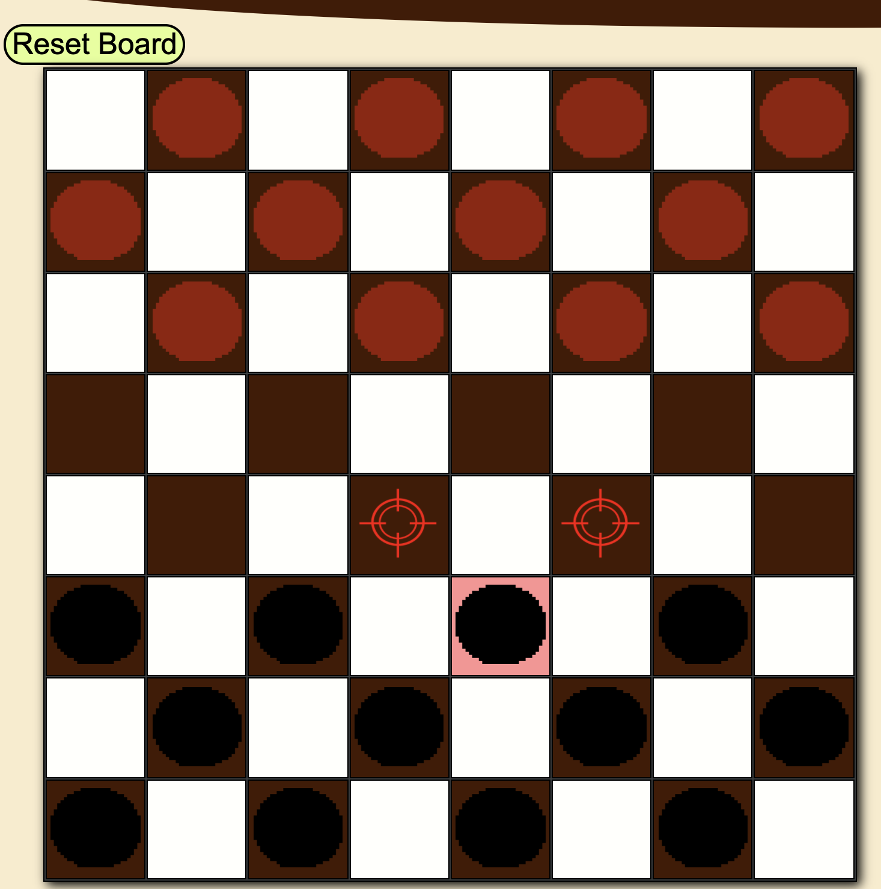

# Checkers

## Description
this is a web based Checkers game using HTML, CSS and Javascript.
the game is Javascript dominant.

### the layout of the website

### the starting position:

### selecting a piece/showing options

### winner display

## Technologies Used
 JavaScript, HTML, CSS.

## Getting Started
This is the link to play the game.

https://b-akbari.github.io/Checkers-Game/

## instructions
Use the mouse to select your piece. click on a targeted box to move your selected piece to said target. capture all of your opponents pieces by 'hopping' over them or trap (unable to move) to win.

## Next Steps: Planned future enhancements (icebox items).
-adding sound effects
-making the page more responsive
-adding current turn
-adding movement animations
-adding AI for 1 player games

## Acknowledgments
A Nod to Filipe, Ivo, Charles, Martin, and the Mongolorians
